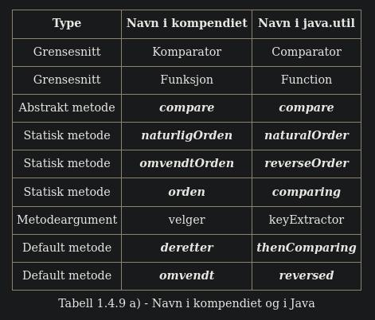

# Oppgaver til Avsnitt 1.4.1
1. Legg de to maks-metodene fra Programkode 1.4.1 a) og b) inn i samleklassen Tabell og lag et program som utfører Programkode 1.4.1 c).
- Done
2. Lag en maks-metode som finner posisjonen til den «største» verdien i en char-tabell. Hvor mange endringer må du gjøre hvis du tar utgangspunkt i maks-metoden for datatypen double, dvs. Programkode 1.4.1 a). Test metoden din ved å legge inn en char-tabell i Programkode 1.4.1 c). Hint: En char-tabell c som for eksempel inneholder tegnene J, A, S, M, I og N, kan lages slik: char[] c = "JASMIN".toCharArray();

Doesn't need to many changes, only changing the type in input and array type.
```java
    public static int maks(char[] a)     // legges i class Tabell
    {
        int m = 0;                           // indeks til største verdi
        char maksverdi = a[0];             // største verdi

        for (int i = 1; i < a.length; i++) if (a[i] > maksverdi)
        {
            maksverdi = a[i];     // største verdi oppdateres
            m = i;                // indeks til største verdi oppdaters
        }
        return m;     // returnerer posisjonen til største verdi
    }

        // in main method
        System.out.println(Tabell.maks(new char[] {'a','f','z','b'}));

        // console printout
        2
```


3. Lag en maks-metode som finner posisjonen til den største verdien i en Integer-tabell. Hvor mange endringer må du gjøre hvis du tar utgangspunkt i maks-metoden for tegnstrenger, dvs. Programkode 1.4.1 b). Test metoden. En testtabell kan du opprette slik: Integer[] a = {5,2,7,3,9,1,8,4,6};

```java
    //     task 1.4.1.3
    public static int maks(Integer[] a)     // legges i class Tabell
    {
        int m = 0;                           // indeks til største verdi
        Integer maksverdi = a[0];             // største verdi

        for (int i = 1; i < a.length; i++) if (a[i] > maksverdi)
        {
            maksverdi = a[i];     // største verdi oppdateres
            m = i;                // indeks til største verdi oppdaters
        }
        return m;     // returnerer posisjonen til største verdi
    }
    
    
```

4. La a og b være ta variabler av typen Integer. Finn ut f.eks. ved å eksperimentere, hva a.compareTo(b) returnerer. Sett så opp den regelen som metoden er kodet etter.
- Returns 1 if a is bigger, -1 if a is smaller, 0 if equal size

5. Finn ut, ved å eksperimentere, hva metoden compareTo i class String returnerer. Du kan f.eks. lage et program som inneholder:

  String s = "A", t = "B";
  System.out.println(s.compareTo(t));
  


Se hvilket tall utskriften gir. Bytt så ut A og B med andre bokstaver, og se om du finner et mønster. Hva blir det hvis s = "A" og t = "a" ? Hvilket tall gir utskriften hvis s = "Æ" og t = "Å" ? Hva hvis s = "Ø" og t = "Å" ? (Se også Avsnitt 1.4.10). Bruk så ord istedenfor enkelttegn. Se spesielt på situasjonen der s utgjør første del av t eller t første del av s, for eksempel s = "Karianne" og t = "Kari". Kildekoden til class String vil gi deg fasiten.

- Seems to give a number outside of the -1, 0, 1 range, that is dependend on the value of the strings


6. 	Ulikhetstegn gjelder ikke for boolean. F.eks. er false < true ulovlig. Men Boolean har metoden public static int compare(boolean x,boolean y) og ved hjelp av den kan vi finne hva som regnes som «minst» og «størst» av false og true. Hva blir utskriften:

  System.out.println(Boolean.compare(false, true));
  
- The compiler find that true is greater than false.

# Oppgaver til Avsnitt 1.4.2
1. Legg inn maks-metoden fra Programkode 1.4.2 b) i klassen Tabell (legg også inn, hvis du ikke gjorde det i forrige avsnitt, maks-metoden fra 1.4.1 b). Lag et program som utfører Programkode 1.4.2 d). Hvilken metode velges? Fjern så maks-metoden for String (dvs. Programkode 1.4.1 b) fra Tabell og utfør Programkode 1.4.2 d) på nytt.
- Done, works well


2. Legg Programkode 1.4.2 e) i klassen Tabell og sjekk at Programkode 1.4.2 f) virker. 
```java
[Ali, Anne, Eva, Kari, Ole, Per]
```

# Oppgaver til Avsnitt 1.4.3
2. 	Omtrent hver gang Java kommer i ny versjon er det noen nye ting i klassen Integer. I API-en vil en se i hvilken versjon det har kommet nye ting. Ta en rask gjennomgang av API-en og se om det er konstanter og metoder der som kan være nyttige. Noen viktige nyheter i Java 8 er metoder for å kunne arbeide uten fortegn. Her er noen eksempler på metoder: toUnsignedString, parseUnsignedInt, compareUnsigned, remainderUnsigned og divideUnsigned. Hva tror du flg. metodekall returnerer: Integer.compare(-1, 1); ? Hva med: Integer.compareUnsigned(-1, 1); ?

- ???

5. 	Lag metoden public static void skriv(Object[] a, int fra, int til). Den skal skrive elementene (mellomrom mellom hvert) fra a[fra:til> på én linje (uten mellomrom til slutt). Lag så en skriv-metode som skriver ut hele a. Lag også tilsvarende metoder med navn skrivln (de skal avslutte med linjeskift). Lag også metoden public static void bytt(Object[] a, int i, int j). Den skal bytte om elementene på plassene i og j i tabellen a. Legg alle metodene i samleklassen Tabell.

```java
    // Task 1.4.3.5
    public static void skriv(Object[] a, int fra, int til) {
        for (int i = 0; i < a.length; i++) {
            System.out.print(a[i] + " ");
        }
    }

    public static void skriv(Object[] a) {
        skriv(a, 0, a.length);
    }

    public static void skrivln(Object[] a, int fra, int til) {
        for (int i = 0; i < a.length; i++) {
            System.out.print(a[i] + " ");
        }
        System.out.print("\n");
    }

    public static void skrivln(Object[] a) {
        skrivln(a, 0, a.length);
    }
```

6. 	Legg bytt og randPermInteger fra Programkode 1.4.3 d) inn i samleklassen Tabell og sjekk at Programkode 1.4.3 e) virker. Lag større tabeller, f.eks. med 20 verdier.

- Done

7. 	Gitt tabellen: double[] d = {5.7,3.14,7.12,3.9,6.5,7.1,7.11};  Lag kode som lager en Double-tabell ved hjelp av den gitte double-tabellen og som så bruker den generiske innsettingssorteringen. Se Programkode 1.4.3 c).

```java
    public static Double[] convertetPrimDouble(double[] d) {

        Double[] b = new Double[d.length];             // en tom Integer-tabell

        for (int i = 0; i < b.length; i++) b[i] = d[i];  // fyller tabellen (autoboksing)

        return b;
    }
```

8. 	Det kan oppstå tvetydigheter hvis primitive typer og omslagsklasser blandes. Metoden public static void f(int a, Integer b) { } har først en int og så en Integer som argument. I metoden public static void f(Integer a, int b) { }  er det motsatt. Dermed er disse metodene forskjellige. Hva vil kompilatoren si til metodekallet f(1,1); Hva skjer hvis en av metodene kommenteres vekk? Hvis begge metodene finnes, hvordan kan en da endre i kallet f(1,1); for at en bestemt av dem skal brukes?

- The program throws an exception due to not knowing which method to choose. You can work aroud this by casting the types of the numbers instead of using ambgious numbers


# Oppgaver til Avsnitt 1.4.4
  1. 	Kopier class Heltall fra Programkode 1.4.4 a) over til deg selv. Opprett mappen (package) eksempelklasser og legg den der.
    	a) Lag og kjør et program med Programkode 1.4.4 c).
    	```java
    	[1, 2, 3, 4, 5, 6, 7, 8, 9, 10]
    	```
    	b) Bruk Programkode 1.4.4 b) i compareTo-metoden. Sjekk at alt virker som før!
    	- funker fortsatt
    	c) La  return verdi - h.verdi;  være kode i compareTo-metoden. Matematisk sett blir det korrekt. Sjekk at alt virker som før. Det er imidlertid et problem her. Hva er det?
    	- Ser ikke ut som at noe annet printes, men er jo et problem at den returner verdier utenfor -1, 0 , 1


  d) Heltall x = new Heltall(3), y = new Heltall(3);  // x og y er like
     System.out.println(x.compareTo(y) + "  " + x.equals(y));
     ```java
        0  true
     ```

  Lag et program som inneholder koden over. Hva blir utskriften? Kommenter så vekk equals-metoden i class Heltall. Da vil det bli den versjonen av equals som arves fra class Object, som brukes. Hva blir nå utskriften? Slå opp i kildekoden til class Object og se hvordan metoden equals er kodet der.


  e) Heltall x = new Heltall(3), y = new Heltall(3);  // x og y er like
     System.out.println(x.hashCode() + "  " + y.hashCode());


  Lag et program som inneholder koden over. Hva blir utskriften? Kommenter så vekk hashCode-metoden i class Heltall. Da vil det bli den versjonen av hashCode som arves fra class Object, som brukes. Hva blir nå utskriften? Slå opp i kildekoden til class Object og se hva som står der om metoden hashCode.
       ```java
          Med metoden
          34  34

          utkommentert hashCode metode
          905544614  2137589296
       ```


  2. 	Kopier klassen Person fra Programkode 1.4.4 d) over til deg. Legg den under package eksempelklasser:

a) Legg inn flere personer i Person-tabellen i Programkode 1.4.4 e).
- ye boi

b) Kjør Programkode 1.4.4 e) etter at du har gjort som i a).
```java
Utskrft:
Boris Zukanovic er størst
[Ali Kahn, Kari Pettersen, Kari Svendsen, Azra Zukanovic, Boris Zukanovic]
```


c) Bruk sort-metoden fra class Arrays i Programkode 1.4.4 e).
```java
    Arrays.sort(p);
    Utskrift:
    Boris Zukanovic er størst
    [Ali Kahn, Kari Pettersen, Kari Svendsen, Azra Zukanovic, Boris Zukanovic]
```
ser ut som at den funker ganske likt

d) Legg inn kode i konstruktøren slik at det kastes en NullPointerException hvis fornavn eller etternavn er null. Ta med en tekst som forteller hvilket navn som er null.

```java
    public Person(String fornavn, String etternavn)   // konstruktør
    {
        if (fornavn == null) {
            throw new NullPointerException("Fornvn kan ikke være null");
        }
        if (etternavn == null) {
            throw new NullPointerException("Etternavn kan ikke være null");
        }

        this.fornavn = fornavn;
        this.etternavn = etternavn;
    }
```

e) Lag en mer direkte versjon av metoden equals(), dvs. uten å bruke compareTo(). Bruk også getClass() != o.getClass() istedenfor !(o instanceof Person). Men da må det først være kode som returnerer false hvis o er null. Hvis ikke, vil o.getClass() kaste en NullPointerException.
f) Lag metoden public boolean equals(Person p). Da trengs ingen typesjekking.

```java
    public boolean equals(Person p) {
        if (p == null) {
            throw new NullPointerException("Person can't be zero");
        }

        return getClass() != p.getClass();
    }
```

g) Metoden hashCode() i klassen Person kan kodes på mange måter. Hvis equals() er kodet, men ikke hashCode(), vil f.eks. NetBeans og Eclipse si ifra og samtidig komme med forslag om hvordan hashCode() skal kodes. Sjekk dette. Obs: I NetBeans er dette en del av standardoppsettet. I Eclipse må du selv sette det som en opsjon. Men du får tilbudet i menyvalget Source. Hash-teknikk blir tatt opp mer grundig i Kapittel 6.
- Nothing happens in intellij

h) I metoden toString i klassen Person skjøtes fornavn, et mellomrom og etternavn sammen. Dette kan også gjøres ved hjelp av metoden join i klassen String. Prøv på det!
```java

    public String toString() { return String.join(" ", fornavn, etternavn); }

Boris Zukanovic er størst
[Ali Kahn, Kari Pettersen, Kari Svendsen, Azra Zukanovic, Boris Zukanovic]
```

i) Legg Programkode 1.4.4 f) bakerst i Programkode 1.4.4 e). Kjør programmet!
Boris Zukanovic

j) Programkode 1.4.4 f) inneholder tre programlinjer. Gjør det om slik at det blir kun én programlinje.

```java
        Arrays.stream(p).max(Comparator.naturalOrder()).ifPresent(System.out::println);
```

# Oppgaver til Avsnitt 1.4.5

  1. 	Flytt enumtypen Studium over til deg. Legg den under (package) eksempelklasser. Lag så et program der Programkode 1.4.5 b) inngår og kjør programmet.

  - done

  2. 	Hvis du ikke allerede er kjent med enumtyper, burde du lære deg mer om dem. En enumtype er en referansetype og fungerer omtrent som andre referansetyper (klasser og grensesnitt). Det som ramses opp i typedefinisjonen kalles enumkonstanter. De bør normalt ha store bokstaver eller minst ha stor forbokstav. Det er mulig å la navnet starte med _ (understrek), $ (dollar) eller £ (pund), men det brukes svært sjelden. En enumtype er en subtype til Object og har dermed alle Object-metodene. En av dem er toString() som er overskrevet (eng: overridden) i Studium. Hvis ikke, ville toString() og name() gi samme resultat, dvs. navnet på enumkonstanten. Det er ikke mulig å opprette instanser av en enumtype ved hjelp av new. Trengs det flere, må de settes opp sammen med de andre i «oppramsingen». En enumtype er alltid Comparable (og har dermed metoden compareTo). Ordningen er den rekkefølgen de har i «oppramsingen». Metoden ordinal() forteller hvilket nummer i rekkefølgen en enumkonstant har. Den første har ordinalverdi lik 0, den neste 1, osv.

  - ok

  3. 	Lag enumtypen Måned. Den skal inneholde konstanter for hver måned (med tre bokstaver), JAN, FEB, . . . , NOV, DES. La typen få en instansvariabel med navn mndnr og en aksessmetode med samme navn. Det betyr at Måned.JAN.mndnr() skal gi 1, osv. til at Måned.DES.mndnr() skal gi 12. La også typen få en instansvariabel med navn fulltnavn. For JAN skal det være januar, osv. Overskriv toString() slik at den gir det fulle navnet. Lag også public static String toString(int mnd) slik at den gir januar for mnd lik 1, osv. La videre Måned ha fire statiske metoder vår(), sommer(), høst() og vinter(). Hver av dem skal reture en Måned-tabell som inneholder de tilsvarende enumkonstantene. Vi sier at APRIL og MAI er vår, JUN, JUL og AUG er sommer, SEP og OKT er høst og at NOV, DES, JAN, FEB og MAR er vinter. Skriv så ut innholdet ved hjelp av et program av samme type som i Programkode 1.4.5 b). Legg Måned under package eksempelklasser.

  4. 	Det hender at en elektrostudent tar emnet Algoritmer og datastrukturer. Utvid enumtypen Studium slik at det også inngår en enumkonstant Elektro. Legge den f.eks. som nr. fire (foran Enkeltemne). Studiets navn er: Ingeniørfag - elektronikk og informasjonsteknologi.

  5. 	Flytt klassen Student over til deg (package eksempelklasser) og sjekk at Programkode 1.4.5 d) virker som de skal. Legg inn et par elektrostudenter (se Oppgave 4) og et par enkeltemnestudenter i tabellen i Programkode 1.4.5 d). Kjør programmet.

- done

# Oppgaver til Avsnitt 1.4.6
1. 	Legg Komparator over til deg (under mappen eksempelklasser), legg metoden i Programkode 1.4.6 b) inn i samleklassen Tabell og sjekk at Programkode 1.4.6 c) virker. Gjør så slik som i Programkode 1.4.6 e) og til slutt slik som i Programkode 1.4.6 f).
- doneeee

2. 	Sjekk at Programkode 1.4.6 g) virker. Utvid tabellen, dvs. med flere studenter og studier. Erstatt så de to siste linjene med Programkode 1.4.6 h). Dropp så komparatorvariabelen c og la isteden lambda-uttrykket inngå direkte som argument i sorteringsmetoden.
- Done i guess hahah

3. 	Lag et lamda-uttrykk som ordner studentene etter studium, fornavn og etternavn.
```java
        Tabell.innsettingssortering(s23, (s11,s2) -> {
            // setter k til å være return verdi fra comparison
            int kk = s11.studium().compareTo(s2.studium());
            // om kk er 0, så var studimene like, da sorterer vi heller på fornavn
            if (kk == 0) {
                kk = s11.fornavn().compareTo(s2.fornavn());
            }
            // om kk fortsatt er null, sorter på etternavn
            if (kk == 0) {
                kk = s11.etternavn().compareTo(s2.etternavn());
            }
            // til slutt returner vi kk, som enten da har verdi fra studium, fornavn eller etternavn
            return kk;
        });
```

4. 	Lag metoden public static <T> int maks(T[] a, Komparator<? super T> c). Bruk f.eks. maks-metoden som utgangspunkt. Legg den i samleklassen Tabell.
- Done, men hva skal den brukes til?

5. 	Utvid lambda-uttrykket i Programkode 1.4.6 i) slik at like lange strenger ordnes alfabetisk. La så tabellen s inneholde "21","18","8","13","20","6","16","25","3","10". Kan du forutsi hvordan den vil bli sortert? Kjør så koden.
- Done

7. 	Lambda-uttrykket i Programkode 1.4.6 h) ordner studiene «naturlig» (dvs. rekkefølgen de har i enumen). Gjør om slik at de ordnes alfabetisk etter navn (Anvendt, Data, IT).
```java
            int kk = s11.studium().toString().compareTo(s2.studium().toString());
```

# Oppgaver til Avsnitt 1.4.7
1. 	La din versjon av grensesnittet Komparator inneholde alt det som er laget i Avsnitt 1.4.7, dvs. dette. Sørg for at det ligger under mappen (package) eksempelklasser. Flytt også grensesnittet Funksjon over til deg (legg det under eksempelklasser).
- Done

2. 	Sorter og skriv ut tabellen Double[] d = {5.7,3.14,7.12,3.9,6.5,7.1,7.11}; Bruk en naturligOrden-komparator. Sorter så tabellen motsatt vei (minst til slutt).
```java
        oppgave("Oppgave 1.4.7.2");
        Double[] dd = {5.7,3.14,7.12,3.9,6.5,7.1,7.11};
        Tabell.innsettingssortering(dd, Komparator.naturligOrden());
        System.out.println(Arrays.toString(dd));
        Tabell.innsettingssortering(dd, Komparator.omvendtOrden());
        System.out.println(Arrays.toString(dd));
        // oppgave 1.4.7.2
```

3. 	Gitt Boolean[] b = {false, true, true, false, false, true, false, true}; Bruk en naturligOrden-komparator til å sortere tabellen. Skriv ut resultatet.
```java
        Tabell.innsettingssortering(b, Komparator.naturligOrden());
```

4. 	Ta utgangspunkt i persontabellen p i Programkode 1.4.6 c). Lag kode som sorterer kun med hensyn på etternavn. Bruk en orden-teknikk.
```java
        Tabell.innsettingssortering(p, Komparator.naturligOrden());
```

5. 	I Programkode 1.4.7 i) sorteres strenger mhp. lengde. Lag kode som sorterer motsatt vei, dvs. lange strenger kommer først. Lag en komparator eller bruk en orden-teknikk. 
```java
        Tabell.innsettingssortering(s, (z,zz) -> zz.length() - z.length());
```

# Oppgaver til Avsnitt 1.4.8
1. 	Utvid din Komparator med det som er laget i Avsnitt 1.4.8, dvs. at den blir lik dette.
- done

2. 	Blir Komparator.orden(x -> x) og Komparator.naturligOrden() det samme? Forklar!
- Tydeligvis, se [Fasit](https://www.cs.hioa.no/~ulfu/appolonius/kap1/4/fasit148.html)

4. 	I Programkode 1.4.7 i) ble det laget en komparator for datatypen String som ordner etter lengde. Men strenger med samme lengde får ingen bestemt orden. Bruk metoden deretter() slik at strenger med samme lengde ordnes alfabetisk. Bruk dette til å sortere s = {"21","18","8","13","20","6","16","25","3","10"};

# Oppgaver til Avsnitt 1.4.9


1. 	Gjør om fra Komparator til Comparator i metoden i Programkode 1.4.6 b). Det eneste som trengs er å bytte ut K med C i metodens signatur. Se også Programkode 1.4.9 b). Sjekk så at Programkode 1.4.9 c) virker. Gjør det samme i maks-metoden hvis du har laget en versjon av den der Komparator inngår (se Oppgave 4 i Avsnitt 1.4.6).
- Done

2. 	Lag en komparator-versjoner (Comparator) av 


a) utvalgssortering, 
```java
    public static <T> void bytt(T[] a, int i, int j) {
        T temp = a[i];
        a[i] = a[j];
        a[j] = temp;
    }

    public static <T> int min(T[] a, int from, int to, Comparator<T> c) {
        fratilKontroll(a.length, from, to);

        int index = from;
        T minverdi = a[from];

        for (int i = from; i < to; i++) {
            if (c.compare(a[i], minverdi) < 0) { // if a[i] is less than minverdi
                index = i;
                minverdi = a[i];
            }
        }

        return index;
    }

    public static <T> void utvalgsSortering(T[] a, int from, int to, Comparator<T> c) {
        for (int i = 0; i < a.length - 1; i++)
            bytt(a, i, min(a, i, a.length, c));  // to hjelpemetoder
    }
```

b) binærsøk, 
```java
    public static <T> int binærsøk(T[] a, int from, int to, T value, Comparator<T> c) {
        Tabell.fratilKontroll(a.length, from, to);  // se Programkode 1.2.3 a)
        int v = from, h = to - 1;  // v og h er intervallets endepunkter

        while (v < h)  // obs. må ha v < h her og ikke v <= h
        {
            int m = (v + h) / 2;  // heltallsdivisjon - finner midten

            if (c.compare(value, a[m]) > 0) v = m + 1;   // value må ligge i a[m+1:h]
            else h = m;                   // value må ligge i a[v:m]
        }
        if (h < v || c.compare(value, a[v]) < 0) return -(v + 1);  // ikke funnet
        else if (value == a[v]) return v;            // funnet
        else return -(v + 2);                       // ikke funnet
    }
```

c) kvikksortering
```java
    private static <T> int parter0T(T[] a, int v, int h, T skilleverdi, Comparator<T> c) {
        while (true)                                  // stopper når v > h
        {
            while (v <= h && c.compare(a[v], skilleverdi) < 0) v++;   // h er stoppverdi for v
            while (v <= h && c.compare(a[h], skilleverdi) >= 0) h--;  // v er stoppverdi for h

            if (v < h) bytt(a, v++, h--);                 // bytter om a[v] og a[h]
            else return v;  // a[v] er nåden første som ikke er mindre enn skilleverdi
        }
    }

    public static <T> int parterT(T[] a, int fra, int til, T skilleverdi, Comparator<T> c) {
        return parter0T(a, fra, til - 1, skilleverdi, c);
    }

    public static <T> int parterT(T[] a, T skilleverdi, Comparator<T> c) {
        return parter0T(a, 0, a.length - 1, skilleverdi, c);
    }


    //    Programkode 1.3.9 f)
    private static <T> int sParter0T(T[] a, int v, int h, int indeks, Comparator<T> c) {
        bytt(a, indeks, h);           // skilleverdi a[indeks] flyttes bakerst
        int pos = parter0T(a, v, h - 1, a[h], c);  // partisjonerer a[v:h - 1]
        bytt(a, pos, h);              // bytter for å få skilleverdien på rett plass
        return pos;                   // returnerer posisjonen til skilleverdien
    }

    //    Programkode 1.3.9 h)
    private static <T> void kvikksortering0(T[] a, int v, int h, Comparator<T> c)  // en privat metode
    {
        if (v >= h) return;  // a[v:h] er tomt eller har maks ett element
        int k = sParter0T(a, v, h, (v + h) / 2, c);  // bruker midtverdien
        kvikksortering0(a, v, k - 1, c);     // sorterer intervallet a[v:k-1]
        kvikksortering0(a, k + 1, h, c);     // sorterer intervallet a[k+1:h]
    }

    public static <T> void kvikksortering(T[] a, int fra, int til, Comparator<T> c) // a[fra:til>
    {
        fratilKontroll(a.length, fra, til);  // sjekker når metoden er offentlig
        kvikksortering0(a, fra, til - 1, c);  // v = fra, h = til - 1
    }

    public static <T> void kvikksortering(T[] a, Comparator<T> c)   // sorterer hele tabellen
    {
        kvikksortering0(a, 0, a.length - 1, c);
    }
```

d) flettesortering
```java
    private static <T> void flett(T[] a, T[] b, int fra, int m, int til, Comparator<T> c)
    {
        int n = m - fra;                // antall elementer i a[fra:m>
        System.arraycopy(a,fra,b,0,n);  // kopierer a[fra:m> over i b[0:n>

        int i = 0, j = m, k = fra;      // løkkevariabler og indekser

        while (i < n && j < til)        // fletter b[0:n> og a[m:til> og
        {                               // legger resultatet i a[fra:til>
            a[k++] = c.compare(b[i], a[j]) <= 0 ? b[i++] : a[j++];
        }

        while (i < n) a[k++] = b[i++];  // tar med resten av b[0:n>
    }
//    Programkode 1.3.11 f)

//            Flg. rekursive (og private) metode benytter flett-metoden i Programkode 1.3.11 f):

    private static <T> void flettesortering(T[] a, T[] b, int fra, int til, Comparator<T> c)
    {
        if (til - fra <= 1) return;   // a[fra:til> har maks ett element
        int m = (fra + til)/2;        // midt mellom fra og til

        flettesortering(a,b,fra,m, c);   // sorterer a[fra:m>
        flettesortering(a,b,m,til, c);   // sorterer a[m:til>

        if (c.compare(a[m-1], a[m]) > 0) flett(a,b,fra,m,til,c);  // fletter a[fra:m> og a[m:til>
    }
//    Programkode 1.3.11 g)

//    I koden over deles a[fra:til> på midten og metoden kalles (rekursjon) først på a[fra:m> og så på a[m:til>. Etterpå vil de være sortert og kan flettes sammen. Legg merke til setningen: if (a[m-1] > a[m]). Intervallet a[fra:til> er allerede sortert hvis den siste i a[fra:m> er mindre enn eller lik den første i a[m:til>. Midtdelingen gjør at dette blir av orden n log2(n) og dermed en effektiv metode. Flg. offentlige metode sorterer en hel tabell:

    public static <T> void flettesortering(T[] a, Comparator<T> c)
    {
        T[] b = Arrays.copyOf(a, a.length/2);   // en hjelpetabell for flettingen
        flettesortering(a,b,0,a.length, c);          // kaller metoden over
    }
//    Programkode 1.3.11 h)
```

3. 	
a) Sjekk at Programkode 1.4.9 f) virker og gir den utskriften som står oppgitt.
- Yupp

b) Bruk komparatoren fra Programkode 1.4.9 d) i Programkode 1.4.9 f). Virker det?
- Yeah

c) De to komparatoren rett under Programkode 1.4.9 e) bruker koordinatene direkte. Bruk dem i Programkode 1.4.9 f). Virker det?
- Yupp
  	
d) Komparatorene i punkt c) over har (Point p) -> p.x i første parentes. Ta vekk Point slik at det kun står p -> p.x. Hva skjer?
- Cannot resolve symbol x

e) Komparatoren i Programkode 1.4.9 f) bruker metodene getX og getY som returnerer en double. Deretter blir double konvertert til Double (autoboksing). Her får vi mer effektiv kode hvis vi isteden bruker comparingDouble og thenComparingDouble. Prøv det!
- aight

f) Anta at vi har en samling punkter i 1. kvadrant (ingen negative koordinater). Lag en komparator som ordner punktene på flg. måte: Et punkt som ligger nærmere origo enn et annet punkt regnes som «mindre» enn det andre. Hvis de ligger like langt fra origo regnes det som har minst y-koordinat som «minst». Bruk den i Programkode 1.4.9 f).
- 

g) Anta at vi har en samling punkter i 1. kvadrant (ingen negative koordinater). Vinkelen til et punkt p forskjellig fra origo defineres som den vinkelen den rette linjen gjennom origo og p danner med x-aksen. Lag en komparator som ordner punktene på flg. måte: Det av to punkter som har minst vinkel regnes som «minst». Hvis de to punktene har samme vinkel, regnes det som minst som ligger nærmest origo. Spesielt gjelder at origo, dvs. punktet (0,0), er «mindre enn» alle andre punkter. Bruk den i Programkode 1.4.9 f).
      
4. 	
a) Flytt Dato til deg (package eksempelklasser). Sjekk at Programkode 1.4.9 h) virker.
- yupp

b) I Programkode 1.4.9 h) inngår den versjonen av innsettingssortering som er laget for sammenlignbare typer, se Programkode 1.4.2 e). Bruk isteden komparatorversjonen ( Programkode 1.4.6 b ) og en naturalOrder-komparator.
- 

c) Sjekk at compareTo() i datoklassen i Programkode 1.4.9 g) oppfyller kravene 1 - 4. Er det slik at x.compareTo(y) = -y.compareTo(x)?

d) Metoden equals() i datoklassen er kodet ved hjelp av compareTo(). Lag egen kode for equals(). Pass på at koden blir slik at x.equals(y) = y.equals(x) for alle datoer x og y. Pass også på at x.equals(y) = true hvis og bare hvis x.compareTo(y) = 0.

e) hashCode() i Dato er laget ved hjelp av en metode fra klassen Objects. Sjekk hva den gjør. Kommentér vekk så hashCode(). Bruker du NetBeans vil du ved siden av equals() få en melding (et gult symbol) om at du bør kode hashCode(). Klikker du på det gule symbolet, vil du få hjelp. Gjør det! Omvendt, har laget hashCode(), men ikke equals(), vil du også få hjelp. Det finnes tilsvarende muligheter i Eclipse - bruk menyvalget Source.

f) Legg inn en ekstra konstruktør i datoklassen. I den skal måneden kunne skrives vha. enumkonstanter fra enum Måned (se Oppgave 3 i Avsnitt 1.4.5). For eksempel skal 17. mai og julaften kunne opprettes ved: Dato mai17 = new Dato(17,Måned.MAI,2016); og Dato julaften = new Dato(24,Måned.DES,2016); Uttskrift skal bli slik: 17. mai 2016 og 24. desember 2016. Lag konstruktøren og de tilleggene og endringene som må til. Bruk StringBuilder når du omkoder toString().

      
5. 	Lag klassen Klokkeslett. Den skal implementere Comparable. Det holder med timer og minutter. Klokkeslett skal ordnes slik at 00:00 kommer først og 23:59 sist. Konstruktøren skal ha en String som argument og være på formen tt:mm, f.eks. "12:00". Lag også metodene equals(), hashCode() og toString(). Bruk Dato-klassen som mønster. Lag en programbit der du oppretter en tabell av klokkeslett som så sorteres og skrives ut.

```java
public class Klokkeslett implements Comparable<Klokkeslett> {
    private final String time;

    public Klokkeslett(String time) {
        this.time = time;
    }

    @Override
    public int compareTo(Klokkeslett klokkeslett) {
        int k = time.substring(0, 1).compareTo(klokkeslett.time.substring(0, 1));
        if (k == 0) {
            k = time.substring(3, 4).compareTo(klokkeslett.time.substring(3, 4));
        }
        return k;
    }

    public boolean equals(Object o)              // equals
    {
        if (o == this) return true;
        if (!(o instanceof Klokkeslett)) return false;
        return compareTo((Klokkeslett) o) == 0;
    }

    public String toString()                     // toString
    {
        return time;
    }

    public int hashCode()
    {
        return Objects.hash(time);
    }
}
```

```java
        oppgave("1.4.9.5");

        Klokkeslett[] timeStamp = {
                new Klokkeslett("01:45"),
                new Klokkeslett("00:21"),
                new Klokkeslett("01:32")
        };

        Tabell.innsettingssortering(timeStamp);
        System.out.println(Arrays.toString(timeStamp));
    }
```

```java
// Uskrift: 
[00:21, 01:32, 01:45]
```
6. 	Lag en klasse Tid som har et klokkeslett og en dato som instansvariabler. Se Oppgave 3 og Programkode 1.4.9 g). Klassen skal implementere Comparable. Tider skal først ordnes mhp. dato og så med hensyn på klokkeslett. Lag også metodene equals, hashCode og toString. Benytt flest mulig av metodene i klassene Dato og Klokkeslett i kodingen. 

```java
public class Tid implements Comparable<Tid> {
    private final Dato dato;
    private final Klokkeslett klokkeslett;

    public Tid(Dato dato, Klokkeslett klokkeslett) {
        this.dato = dato;
        this.klokkeslett = klokkeslett;
    }

    public Tid(int dag, int mnd, int year, String tid) {
        this.dato = new Dato(dag, mnd, year);
        this.klokkeslett = new Klokkeslett(tid);
    }

    @Override
    public int compareTo(Tid t) {
        int k = this.dato.compareTo(t.dato);
        if (k == 0) {
            k = this.klokkeslett.compareTo(t.klokkeslett);
        }
        return k;
    }

    public boolean equals(Object o)              // equals
    {
        if (o == this) return true;
        if (!(o instanceof Tid)) return false;
        return compareTo((Tid)o) == 0;
    }

    public String toString()                     // toString
    {
        return dato.toString() + " " + klokkeslett.toString();
    }

    public int hashCode()
    {
        return Objects.hash(dato.hashCode(),klokkeslett.hashCode());
    }
}
```

```java
        Tid[] tider = new Tid[4];

        tider[0] = new Tid(24,12,2014,"15:30");
        tider[1] = new Tid(24,12,2014,"12:00");
        tider[2] = new Tid(23,12,2014,"12:00");
        tider[3] = new Tid(23,12,2014,"09:00");

        for (Tid tid : tider) System.out.println(tid);

        System.out.println("\n\nTider sortert\n");

        Tabell.innsettingssortering(tider);

        for (Tid tid : tider) System.out.println(tid);
```

```
 Oppgave 1.4.9.9 

24/12-2014 15:30
24/12-2014 12:00
23/12-2014 12:00
23/12-2014 09:00


Tider sortert

23/12-2014 09:00
23/12-2014 12:00
24/12-2014 12:00
24/12-2014 15:30
```